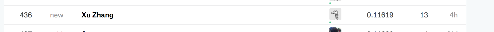

# STA695 Champions Competition 1

### Our kaggle rank

### contribution

The model we used: LightGBM, XGBoost, Lasso, ENet, SVR, Bayesian Ridge, and use cross validation staking models together.

### Things we learned

Data clean is really important!
